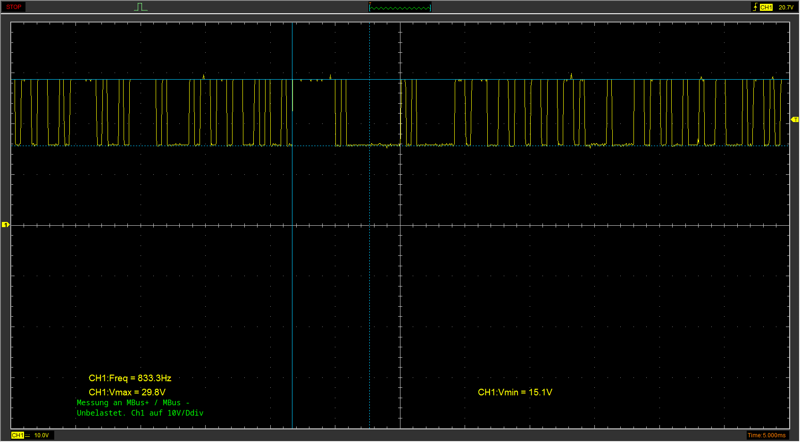
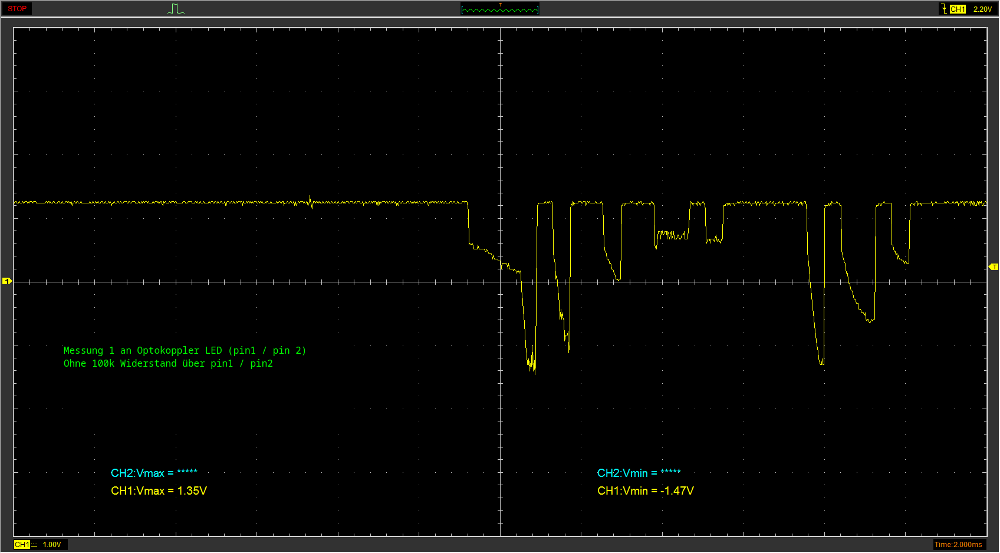
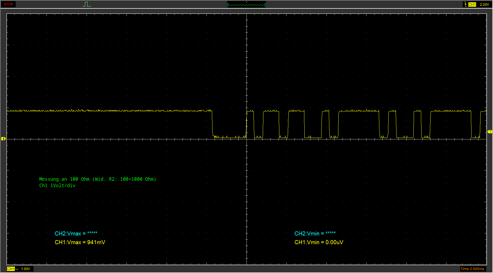

## Fotos:
1) MBus unbelastet:

2) Signal an LED vom Optokoppler (mit 1100 Ohm gesamt Vorwiderstand):

3) Signal an 100 Ohm Widerstand vor Optokoppler (mit 1100 Ohm gesamt Vorwiderstand):

4) MBus unbelastet:

5) MBus unbelastet:

6) MBus unbelastet:

7) MBus unbelastet:

8) MBus unbelastet:

