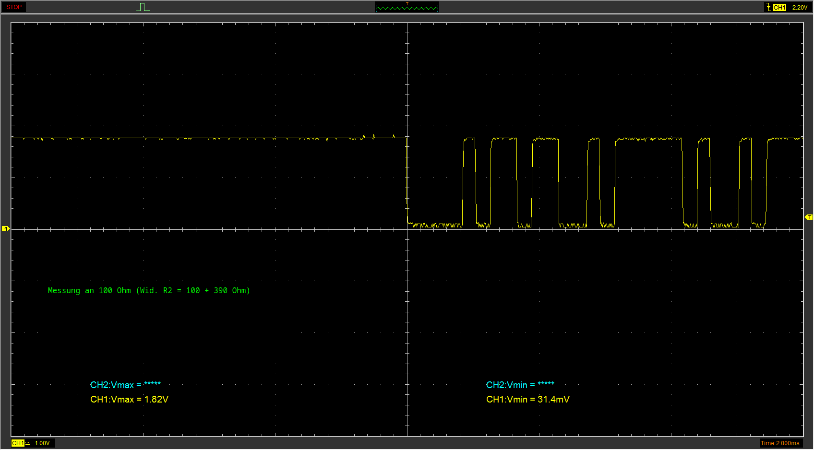

## Fotos:
1) Signal am MBus Stecker (unbelastet):

2a) Signal an LED vom Optokoppler (mit 1100 Ohm gesamt Vorwiderstand):

2b) Signal an LED vom Optokoppler mit 100kOhm parallel zur Optokoppler LED (mit 1100 Ohm gesamt Vorwiderstand):

3) Signal an 100 Ohm Widerstand vor Optokoppler (mit 1100 Ohm gesamt Vorwiderstand):

4) Signal am ESP input pin (MBus Signal mit 1100 Ohm Vorwiderstand):

5) Signal an LED vom Optokoppler (mit 100+390 Ohm gesamt Vorwiderstand):

6) Signal an 100 Ohm Widerstand vor Optokoppler (mit 100+390 Ohm gesamt Vorwiderstand):

7) Signal am ESP input pin (MBus Signal mit 500 Ohm Vorwiderstand):

8) Signal an MBus mit 15VZener + LED + 1100 Ohm gesamt Vorwiderstand:

